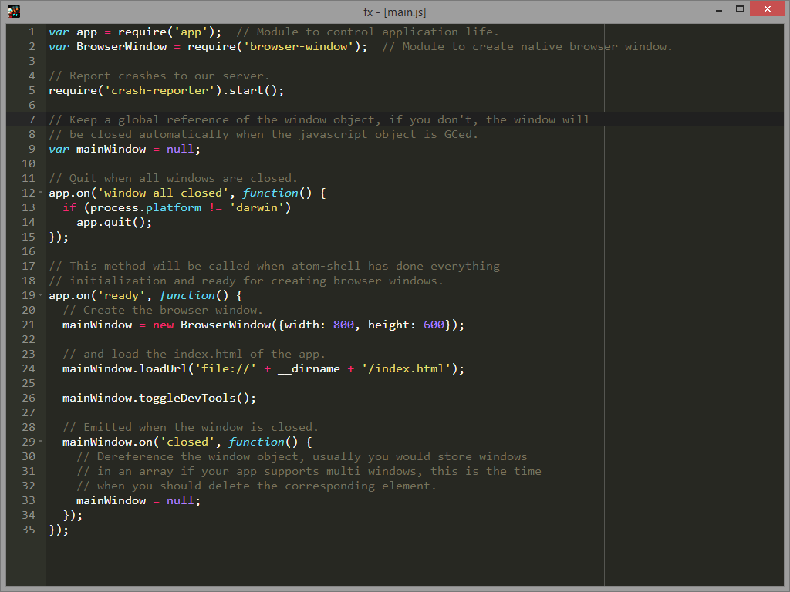

fx
==

A port of Frehley from Node-Webkit to Atom-Shell

Main Window:

Control Panel:

## Usage

This editor requires Atom-Shell

- Clone or download a zip this repository
- Unzip the code into it's own folder
- Download Atom-Shell from https://github.com/atom/atom-shell
- Unzip Atom-Shell
- Run Atom-Shell and drag the editor source code directory onto the Atom-Shell default app

Key short cuts

- CTRL+O - Opens the file open dialog
- CTRL+S - Saves file being edited or opens the file save as dialog
- CTRL+N - Creates new empty buffer
- CTRL+M - Closes the current file being edited
- CTRL+ALT+M - Closes all files being edited
- CTRL+ALT+B - Reloads the editor in Node-Webkit
- CTRL+TAB - Cycles through opened files
- F1 - Opens the start screen (unfinished)
- F2 - Opens the control panel (switch editor theme, font size and current buffer, etc...)
- F3 - Cycle threw the Ace editor themes 
- F10 - Opens the help page
- F11 - Shows About information which also contains changelog data
- F12 - Opens Node-Webkit Dev Tools

You can drag files onto the editor and it will open the files for editing. Use CTRL+TAB to cycle through
them or hit F2 to open the control panel and select the file you want from the buffer list.
